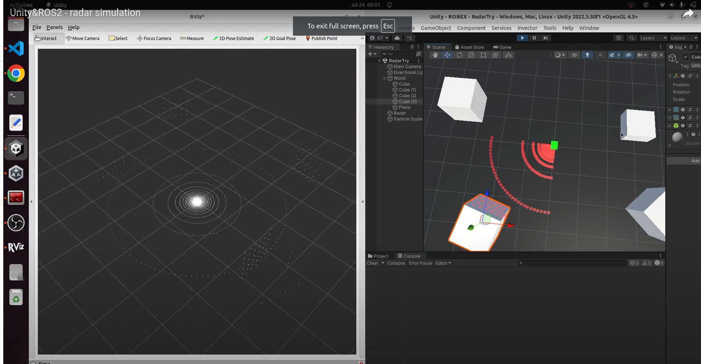

# radarSimu---Unity-ROS2

### To install it:
- import the unity Package "radarpackageV1.unitypackage". (If you have a problem with ros2.cs, replace the imported ROS2forUnity folder by the one you just clone in Assets/)
- or copy/paste the Assets folder in your project


### To Launch it: 
Open the scene named radarTry

If you want to create your own scene, add the radar prefab in your scene.


### To visualize the result:
- Launch the scene
- open a terminal, source ros2 humble
- you can now check the simulated radar pointcloud in your ros2 environment,
- enter 
```bash
"ros2 topic echo /simu/radar"
```
or 
```bash
"rviz2"
```
to visualize your result!

### Watch the demo on Youtube!
[🎥 Watch the demo!](https://www.youtube.com/watch?v=d3VPCv4Vso0)

### Results !


